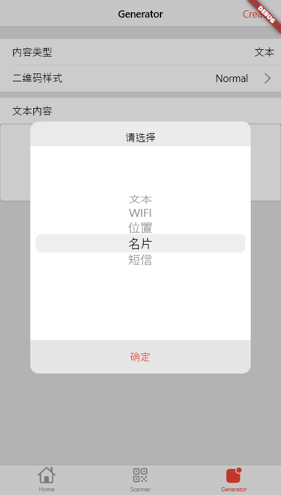
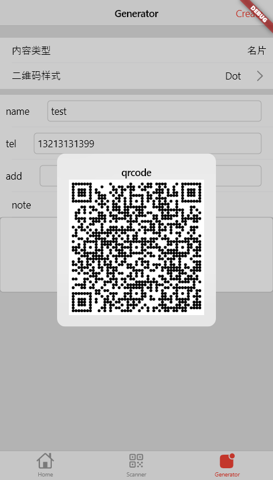

# ZXing-Dart

A Dart port of [zxing](https://github.com/zxing/zxing) that encode and decode multiple 1D/2D barcodes, Supported qrcode, pdf417, oned, maxicode, datamatrix, aztec.

## Why

* Pure Dart implementation, no need to rely on native packages, good platform compatibility
* Provide pure Dart encoding for all platforms
* Provide pure Dart decoding for all platforms
* Research learning and an exploration of Dart language

... At present, this package is far inferior to other native packages in decoding speed and accuracy, and can be used as a decoding tool and some platforms (such as Web and Desktop). I will also continue to pay attention to the improvement of zxing and the improvement of the performance problems in this project. And welcome suggestions for improvement from those with experience in decoding algorithms and image algorithms.

## Feature

- ✅ Core package translate
- ✅ Core test translate
- ✅ Core unit test(all passed)
- ✅ Demo Creator
- ✅ Demo Scanner
- ✅ Code optimization

- 🚧 Keep syncing from zxing java...

## Preview

|Demo App| |
|:---:|:---:|
|||

## Exception Type
* IllegalArgumentException => ArgumentError
* FormatException => FormatsException
* IllegalStateException => StateError

## Issue
* Because there is no float type in dart, the results of some test cases are different from zxing

## Flutter

This project is a starting point for a Dart
[package](https://flutter.dev/developing-packages/),
a library module containing code that can be shared easily across
multiple Flutter or Dart projects.

For help getting started with Flutter, view our 
[online documentation](https://flutter.dev/docs), which offers tutorials, 
samples, guidance on mobile development, and a full API reference.
